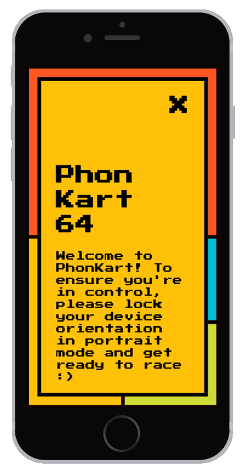
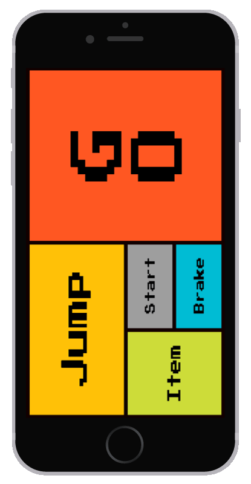

# Pantin64
Open a browser on a computeur and play MarioKart 64 with you touch device!
HTML buttons for controls and device rotation for turns.
Multiplayer now supported :D

## Exemple

## Installation
For your web app and server, you need:
* [node.js](https://nodejs.org/en/)
* [socket.io](http://socket.io/)
* [RobotJS](https://github.com/octalmage/robotjs)
* [Express](https://www.npmjs.com/package/express)

And of course an emulator of Nitendo64 and a ROM. I use [SixtyForce](http://sixtyforce.com/) (Mac) and [this ROM](http://emu-fr.net/v1/module.php?page=programme_detail&type_programme=roms&i=1611).
As the program is merely a gamepad, you should be able to use it for any other game/application.

## Testing
1. Connect your laptop and phone on the same network
2. Start your emulator and ROM
3. Go on settings and setup the keys according to the JSON at the end of server.js
4. Lunch the server : `node server.js`
5. On your mobile device, go to you server local address on port 3000 : *192.168.1.XX:3000*
6. You're good! Use touch buttons for controls and orient your device left or right for turning!

## To Improve
* Use pixel detection for changing aspect/behavior of the gamepad depending of the state of the emulator : waiting for opponent/menu/playing...
* Find a better name : KontrolKart64 ? SmartphoneKart ?
* Go online : Resberry/Linux :
  * Use [CEN64](https://github.com/tj90241/cen64) or [Mupen64Plus](http://www.mupen64plus.org/)
  * Recompile [SixtyForce](http://sixtyforce.com/) for linux
  * Run [SixtyForce](http://sixtyforce.com/) with [Darling](www.darlinghq.org)
  * Run any [other windows emulator](https://en.wikipedia.org/wiki/List_of_video_game_emulators#Nintendo_64) on linux using [Wine](https://www.winehq.org/)
  * Buy a Mac Mini for setting up a server at home. Easy, but bandwith and speed won't be brillant

*Thinks to keep in mind in the choice of emulator :*
  * Works / Stable
  * Support 4 players (or easy improvement)
  * ~~Support analogic pad~~ now emulate it ;)

