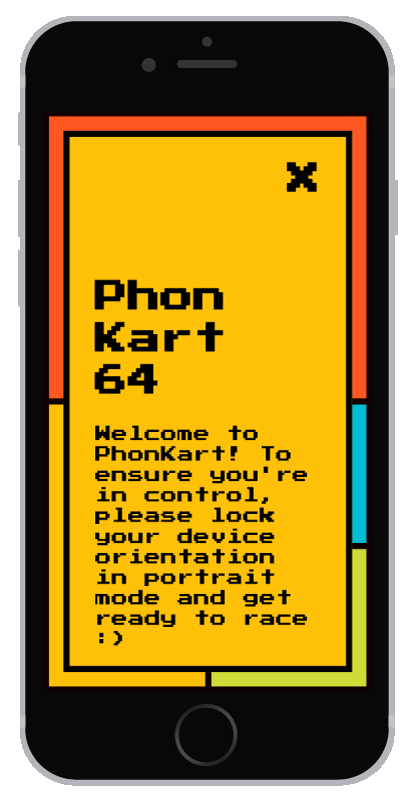
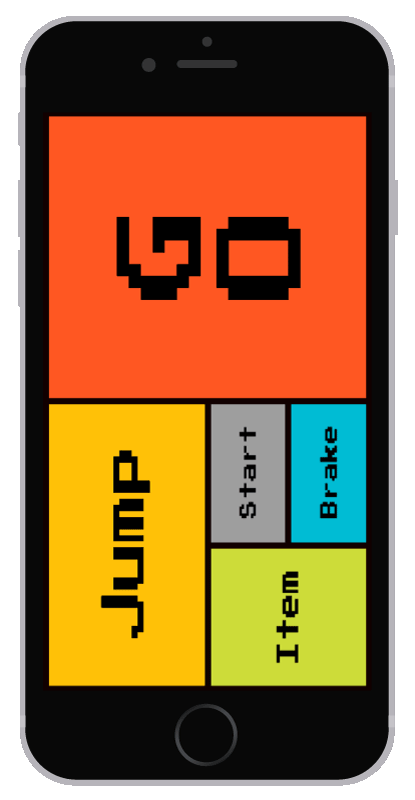

# Pantin64
Open a browser on a computeur and play MarioKart 64 with you smartphone!
HTML buttons for controls and device rotation for turns.
Multiplayer supported :D

## Exemple

## Installation
For your web app and server, you need:
* [node.js](https://nodejs.org/en/)
* [socket.io](http://socket.io/)
* [RobotJS](https://github.com/octalmage/robotjs)
* [Express](https://www.npmjs.com/package/express)
* [bezier-easing](https://github.com/gre/bezier-easing)

And of course an emulator of Nitendo64 and a ROM.
I use [Mupen64Plus](http://www.mupen64plus.org/) and [this ROM](http://emu-fr.net/v1/module.php?page=programme_detail&type_programme=roms&i=1611).
As the program is merely a gamepad, you should be able to use it for any other game/application.

## Testing
1. Connect your laptop and phone on the same network
2. Start your emulator and ROM
3. Move InputAutoCfg.ini in Mupen directory
4. Lunch the server : `node server.js`
5. On your mobile device, go to you server local address on port 3000 : *192.168.1.XX:3000*
6. You're good! Use touch buttons for controls and orient your device left or right for turning!

versions<0.7 -> use SixtyForce (mac). Don't forget to set up the controls on the emulator according to the json.

## TODO
* Install tests
* Use pixel detection for changing aspect/behavior of the gamepad depending of the state of the emulator : waiting for opponent/menu/playing...
* Find a better name : KontrolKart ? SmartphoneKart64 ?
* Go online:
  * Resberry/Linux
  * Stream the emulator video online
* Use analogic pad of [Mupen64Plus](http://www.mupen64plus.org/) OR use shift/alt modifyers of [Mupen64Plus](http://www.mupen64plus.org/) OR ~~emulate it~~ correct the emulation
* Update preview gif

